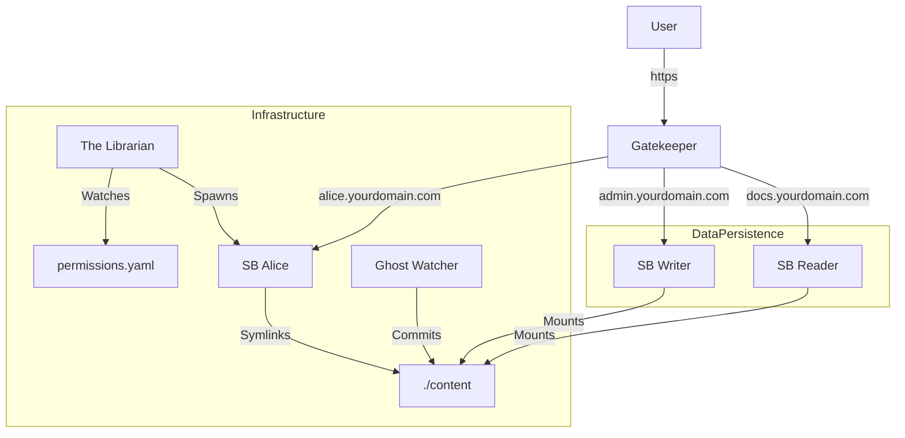

# ng-brain
Self-hosted, text-first digital garden OS powered by SilverBullet, Nginx, and Docker.

**ng-brain** separates the Engine (this repo) from the Content (your data) so you can upgrade or replace infrastructure without touching your notes. It turns a standard SilverBullet instance into a multi-user platform with public/private access, automatic background versioning, and per-user permissions.

## Overview
- Engine: Docker, Nginx templates, and the Go-based Librarian orchestrator (ephemeral).
- Content: Your Git repo at ./content (ignored by the engine, fully yours).
- Outcome: Multi-tenant, permissioned SilverBullet with public docs, private writer, and per-user sandboxes.

## Features
- Text-first workflow: author in your editor of choice (VS Code, Vim, Emacs, etc.) while collaborators get a lightweight web UI for quick access.
- Gatekeeper: Unified Nginx reverse proxy routing public, admin, and per-user subdomains.
- Librarian: Go orchestrator reading permissions.yaml to spin up/tear down user containers and manage symlinks.
- Ghost Watcher: Background git snapshots every 5 minutes to avoid data loss.
- Time Travel UI: Sidebar plugin for commit history, diffs, and read-only past versions.
- Centralized Tooling: Shared plugins (Mermaid, Excalidraw, TreeView) updated once and propagated to all spaces.

## Architecture
ng-brain follows a split-brain model: Engine (infrastructure) vs. Content (data).

## Demo
- Live public SilverBullet reader: https://docs.nourgaser.com



## Requirements
- Docker and Docker Compose
- Domain with wildcard DNS (*.yourdomain.com) pointing to the host

## Quick Start
1) Clone the engine
```bash
git clone https://github.com/nourgaser/ng-brain.git
cd ng-brain
```

2) Create the content repo
```bash
mkdir content
cd content && git init && cd ..
```

3) Create a .env file (see Configuration)

4) Launch the stack
```bash
docker compose up -d
```

5) Access
- Writer: https://admin.yourdomain.com
- Reader: https://docs.yourdomain.com
- User spaces: https://<user>.yourdomain.com

## Configuration
Sample .env (adjust domains and paths):
```env
# Domains
PUBLIC_HOST=docs.nourgaser.com
ADMIN_HOST=admin.nourgaser.com
SPACE_DOMAIN_SUFFIX=yourdomain.com

# Credentials
SB_WRITER_USER=admin
SB_WRITER_PASSWORD=change_this_immediately

# Host paths
HOST_ROOT_DIR=/home/user/docker/ng-brain
```

## Permissions
Define users and access levels in content/permissions.yaml. The Librarian consumes this file and provisions containers dynamically.

```yaml
spaces:
  public:
    paths:
      - "index.md"
      - "assets/"
      - "Library/Core.md"

  alice:
    password: "secret_password"
    paths:
      - "projects/secret-game/"
      - "assets/"
```

## Services
- Gatekeeper (Nginx): Routes public, admin, and per-user subdomains.
- Librarian (Go): Watches permissions.yaml, manages per-user containers and symlinks.
- Ghost Watcher: Runs periodic git snapshots of ./content.
- SilverBullet Writer/Reader: Authenticated writer and public read-only instance.

## Advanced Usage
- Ghost Watcher
  - Logs: `docker logs -f ng-watcher`
  - On-demand snapshot: open the Command Palette and run "Git: Snapshot Now".
- History Sidebar
  - Uses the bundled Lua script to show history/diffs inside SilverBullet.

## Roadmap
- [ ] GitHub 2-way sync to replace local Ghost Watcher with remote sync.
- [ ] Docker-in-Docker builds for custom per-user images.
- [ ] CI/CD to auto-deploy engine changes.
- [ ] Unified search across spaces.
- [ ] Off-site backups for ./content (S3/R2).

## 📄 License
MIT License. Built on top of SilverBullet by Zef Hemel.
